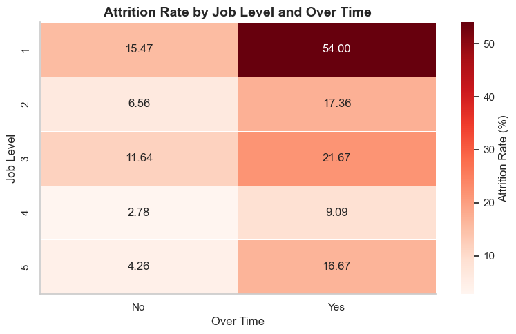

# 

# 📊 Optimización de Talento y Retención (ABC Corporation)

## 📌 Descripción del proyecto

Este proyecto tiene como objetivo analizar el fenómeno de **attrition (rotación de empleados)** en ABC Corporation, con el fin de identificar patrones, factores clave y proponer acciones que permitan mejorar la retención del talento.

El proyecto sigue un enfoque completo de análisis de datos, abarcando desde la exploración inicial hasta la integración de los datos en una base de datos relacional.

---

## 🎯 Objetivos

- Analizar los factores que influyen en la rotación de empleados  
- Identificar perfiles de riesgo dentro de la organización  
- Extraer insights accionables para la toma de decisiones  
- Construir un flujo completo de tratamiento de datos (EDA, limpieza, análisis y ETL)  

---

## 🧩 Estructura del proyecto

El proyecto se divide en varias fases:

### 🔹 Fase 1 - Análisis Exploratorio (EDA)
- Validación del dataset  
- Detección de nulos, duplicados e inconsistencias  
- Identificación de variables problemáticas  
- Contextualización del dataset  

---

### 🔹 Fase 2 - Transformación y Limpieza
- Eliminación de variables redundantes  
- Limpieza de variables categóricas  
- Imputación de valores nulos  
- Conversión de tipos de datos  
- Enriquecimiento de variables (ej. JobRole)  

---

### 🔹 Fase 3 - Análisis y Visualización
- Análisis de variables clave  
- Estudio del attrition por segmentos  
- Identificación de drivers principales  
- Análisis de satisfacción del empleado  

---


### 🔹 Fase 4  - ETL 
- Uso del dataset limpio generado en Fase 2  
- Conexión a base de datos mediante SQLAlchemy  
- Carga del DataFrame en MySQL  
- Creación del schema **ABC_Corporation**  
- Creación de la tabla **employees_attrition**  

---

## 🧠 Principales insights

El análisis revela que el attrition está influido por múltiples factores:

- Mayor rotación en **niveles jerárquicos bajos**  
- Impacto significativo del **Over Time**  
- Combinación de **bajo nivel + alta carga de trabajo** como segmento crítico  
- Influencia del salario, condicionada por el nivel  
- Menor satisfacción en empleados que abandonan la empresa  

---

## 📊 Visualización destacada



Esta visualización muestra cómo la combinación de nivel jerárquico y carga de trabajo (Over Time) influye significativamente en la rotación, identificando segmentos críticos dentro de la organización.

---

## 💡 Recomendaciones

- Reducir la carga de trabajo (Over Time)  
- Reforzar el onboarding y primeros años  
- Definir planes de carrera claros  
- Mejorar la satisfacción del empleado  
- Aplicar incentivos a largo plazo  

---

## 🛠️ Tecnologías utilizadas

- Python  
- Pandas  
- Matplotlib / Seaborn  
- MySQL  
- SQLAlchemy  
- Jupyter Notebook  

---

## 📁 Estructura del repositorio

```bash
project-da-promo-65-modulo-3-team-3/
│
├── assets/
│   └── attrition_heatmap.png
│
├── files/
│   ├── raw/
│   │   └── hr.csv
│   └── processed/
│       └── datos_limpios.csv
│
├── notebooks/
│   ├── dev/
│   │   └── pruebas_transformacion.ipynb
│   ├── 01_eda.ipynb
│   ├── 02_transformacion.ipynb
│   ├── 03_visualizacion.ipynb
│   └── 04_etl.ipynb
│
├── src/
│   ├── soporte_nulos.py
│   └── soporte_visualizaciones.py
│
├── docs/
│   ├── optimizacion_talento_documentacion.md
│   ├── optimizacion_talento_historias_usuario.pdf
│   └── ppt/
│
├── .gitignore
│
└── README.md

---

## 🔄 Flujo del proyecto

1. Exploración del dataset  
2. Limpieza y transformación  
3. Análisis y visualización  
4. Diseño de base de datos  
5. Carga de datos mediante ETL  

---

## 🚀 Conclusión

Este proyecto no solo analiza el attrition, sino que construye un flujo completo de tratamiento de datos, desde la exploración hasta su almacenamiento en base de datos.

Esto permite transformar los datos en una herramienta útil para la toma de decisiones en la gestión del talento.

---

## 👩‍💻 Autor

Proyecto desarrollado como parte del bootcamp de Data Analytics.